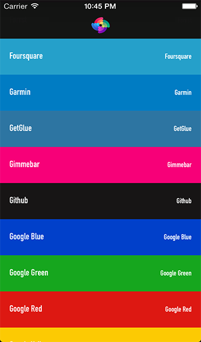
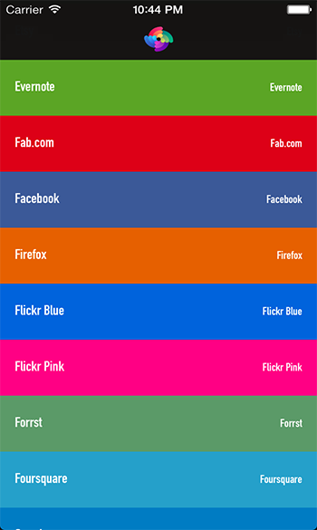
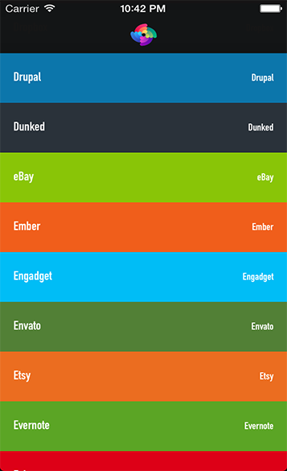
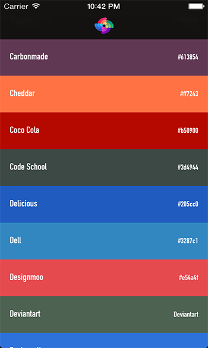
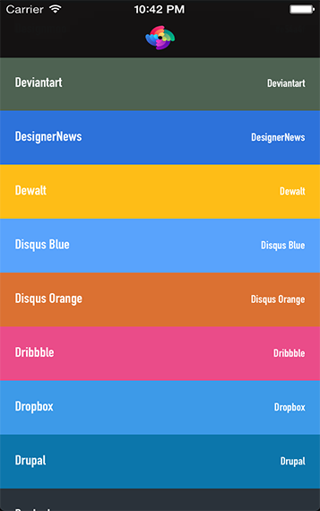
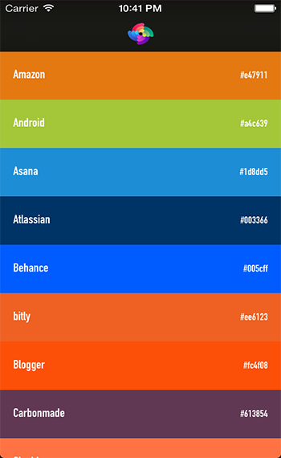

FPBrandColors
=============

A category for UIColor a collection of major brand color codes

About
----------
FPBrandColors is a simple category on UIColor which provides you some of the Brand colors used throughout.

## Preview

[](https://raw.github.com/magtory/FPBrandColors/master/Screenshots/Full-01.png)
[](https://raw.github.com/magtory/FPBrandColors/master/Screenshots/Full-02.png)
[](https://raw.github.com/magtory/FPBrandColors/master/Screenshots/Full-03.png)
[](https://raw.github.com/magtory/FPBrandColors/master/Screenshots/Full-04.png)
[](https://raw.github.com/magtory/FPBrandColors/master/Screenshots/Full-05.png)
[](https://raw.github.com/magtory/FPBrandColors/master/Screenshots/Full-06.png)


## Requirements

FPBrandColors works on any iOS version and is compatible with both ARC and non-ARC projects. It depends on the following Apple frameworks, which should already be included with most Xcode templates:

* Foundation.framework
* UIKit.framework
* CoreGraphics.framework

You will need LLVM 3.0 or later in order to build FPBrandColors. 


## Adding FPBrandColors to your project

### Cocoapods

[CocoaPods](http://cocoapods.org) is the recommended way to add FPBrandColors to your project.

1. Add a pod entry for FPBrandColors to your Podfile `pod 'FPBrandColors', '~> 0.1.3'`
2. Install the pod(s) by running `pod install`.
3. Include FPBrandColors wherever you need it with `#import "UIColor+FPBrandColor.h"`.

### Source files

Alternatively you can directly add the `UIColor+FPBrandColor.h` and `UIColor+FPBrandColor.m` source files to your project.

1. Download the [latest code version](https://github.com/magtory/FPBrandColors/archive/master.zip) or add the repository as a git submodule to your git-tracked project. 
2. Open your project in Xcode, then drag and drop `UIColor+FPBrandColor.h` and `UIColor+FPBrandColor.m` onto your project (use the "Product Navigator view"). Make sure to select Copy items when asked if you extracted the code archive outside of your project. 
3. Include FPBrandColor wherever you need it with `#import "UIColor+FPBrandColor.h"`.

Example
--------------

```Obj-C

textLabel.textColor = [UIColor Facebook];
 
self.navigationController.navigationBar.barTintColor = [UIColor Instagram];
```

Color List
----------

    + (UIColor *) Fourormat;
    + (UIColor *) FiveHundredPX;
    + (UIColor *) AboutMeBlue;
    + (UIColor *) AboutMeYellow;
    + (UIColor *) Addvocate;
    + (UIColor *) Adobe;
    + (UIColor *) Aim;
    + (UIColor *) Amazon;
    + (UIColor *) Android;
    + (UIColor *) Asana;
    + (UIColor *) Atlassian;
    + (UIColor *) Behance;
    + (UIColor *) bitly;
    + (UIColor *) Blogger;
    + (UIColor *) Carbonmade;
    + (UIColor *) Cheddar;
    + (UIColor *) CocaCola;
    + (UIColor *) CodeSchool;
    + (UIColor *) Delicious;
    + (UIColor *) Dell;
    + (UIColor *) Designmoo;
    + (UIColor *) Deviantart;
    + (UIColor *) DesignerNews;
    + (UIColor *) Dewalt;
    + (UIColor *) DisqusBlue;
    + (UIColor *) DisqusOrange;
    + (UIColor *) Dribbble;
    + (UIColor *) Dropbox;
    + (UIColor *) Drupal;
    + (UIColor *) Dunked;
    + (UIColor *) eBay;
    + (UIColor *) Ember;
    + (UIColor *) Engadget;
    + (UIColor *) Envato;
    + (UIColor *) Etsy;
    + (UIColor *) Evernote;
    + (UIColor *) Fab;
    + (UIColor *) Facebook;
    + (UIColor *) Firefox;
    + (UIColor *) FlickrBlue;
    + (UIColor *) FlickrPink;
    + (UIColor *) Forrst;
    + (UIColor *) Foursquare;
    + (UIColor *) Garmin;
    + (UIColor *) GetGlue;
    + (UIColor *) Gimmebar;
    + (UIColor *) GitHub;
    + (UIColor *) GoogleBlue;
    + (UIColor *) GoogleGreen;
    + (UIColor *) GoogleRed;
    + (UIColor *) GoogleYellow;
    + (UIColor *) GooglePlus;
    + (UIColor *) Grooveshark;
    + (UIColor *) Groupon;
    + (UIColor *) HackerNews;
    + (UIColor *) HelloWallet;
    + (UIColor *) HerokuLight;
    + (UIColor *) HerokuDark;
    + (UIColor *) HootSuite;
    + (UIColor *) Houzz;
    + (UIColor *) HP;
    + (UIColor *) HTML5;
    + (UIColor *) Hulu;
    + (UIColor *) IBM;
    + (UIColor *) IKEA;
    + (UIColor *) IMDb;
    + (UIColor *) Instagram;
    + (UIColor *) Instapaper;
    + (UIColor *) Intel;
    + (UIColor *) Intuit;
    + (UIColor *) Kickstarter;
    + (UIColor *) kippt;
    + (UIColor *) Kodery;
    + (UIColor *) LastFM;
    + (UIColor *) LinkedIn;
    + (UIColor *) Livestream;
    + (UIColor *) Lumo;
    + (UIColor *) MakitaRed;
    + (UIColor *) MakitaBlue;
    + (UIColor *) Mixpanel;
    + (UIColor *) Meetup;
    + (UIColor *) Netflix;
    + (UIColor *) Nokia;
    + (UIColor *) NVIDIA;
    + (UIColor *) Odnoklassniki;
    + (UIColor *) Opera;
    + (UIColor *) Path;
    + (UIColor *) PayPalDark;
    + (UIColor *) PayPalLight;
    + (UIColor *) Pinboard;
    + (UIColor *) Pinterest;
    + (UIColor *) PlayStation;
    + (UIColor *) Pocket;
    + (UIColor *) Prezi;
    + (UIColor *) Pusha;
    + (UIColor *) Quora;
    + (UIColor *) QuoteFm;
    + (UIColor *) Rdio;
    + (UIColor *) Readability;
    + (UIColor *) RedHat;
    + (UIColor *) RedditBlue;
    + (UIColor *) RedditOrange;
    + (UIColor *) Resource;
    + (UIColor *) Rockpack;
    + (UIColor *) Roon;
    + (UIColor *) RSS;
    + (UIColor *) Salesforce;
    + (UIColor *) Samsung;
    + (UIColor *) Shopify;
    + (UIColor *) Skype;
    + (UIColor *) SmashingMagazine;
    + (UIColor *) Snagajob;
    + (UIColor *) Softonic;
    + (UIColor *) SoundCloud;
    + (UIColor *) SpaceBox;
    + (UIColor *) Spotify;
    + (UIColor *) Sprint;
    + (UIColor *) Squarespace;
    + (UIColor *) StackOverflow;
    + (UIColor *) Staples;
    + (UIColor *) StatusChart;
    + (UIColor *) Stripe;
    + (UIColor *) StudyBlue;
    + (UIColor *) StumbleUpon;
    + (UIColor *) TMobile;
    + (UIColor *) Technorati;
    + (UIColor *) TheNextWeb;
    + (UIColor *) Treehouse;
    + (UIColor *) Trello;
    + (UIColor *) Trulia;
    + (UIColor *) Tumblr;
    + (UIColor *) TwitchTv;
    + (UIColor *) Twitter;
    + (UIColor *) Typekit;
    + (UIColor *) TYPO3;
    + (UIColor *) Ubuntu;
    + (UIColor *) Ustream;
    + (UIColor *) uTorrent;
    + (UIColor *) Venmo;
    + (UIColor *) Verizon;
    + (UIColor *) Vimeo;
    + (UIColor *) Windows;
    + (UIColor *) WindowsPhone;
    + (UIColor *) Vine;
    + (UIColor *) Virb;
    + (UIColor *) VirginMedia;
    + (UIColor *) VKontakte;
    + (UIColor *) Wooga;
    + (UIColor *) WordPressBlue;
    + (UIColor *) WordPressOrange;
    + (UIColor *) WordPressGrey;
    + (UIColor *) Wunderlist;
    + (UIColor *) XBOX;
    + (UIColor *) XING;
    + (UIColor *) Yahoo;
    + (UIColor *) Yandex;
    + (UIColor *) Yelp;
    + (UIColor *) YouTube;
    + (UIColor *) Zalongo;
    + (UIColor *) Zendesk;
    + (UIColor *) Zerply;
    + (UIColor *) Zootool;


Reap What I Sow!
-

This project is distributed under the standard MIT License. Please use this and twist it in whatever fashion you wish - and recommend any cool changes to help the code.

## Credits

- [Faprica LTD](http://www.faprica.com)
- [Melih Buyukbayram](http://twitter.com/melihbuyuk)

## New Brand Color
If you wish to suggest a new brand, report a bug, or pitch a new feature idea for Brand Colors. Please create an issue and I'll get back to you as soon as possible.
