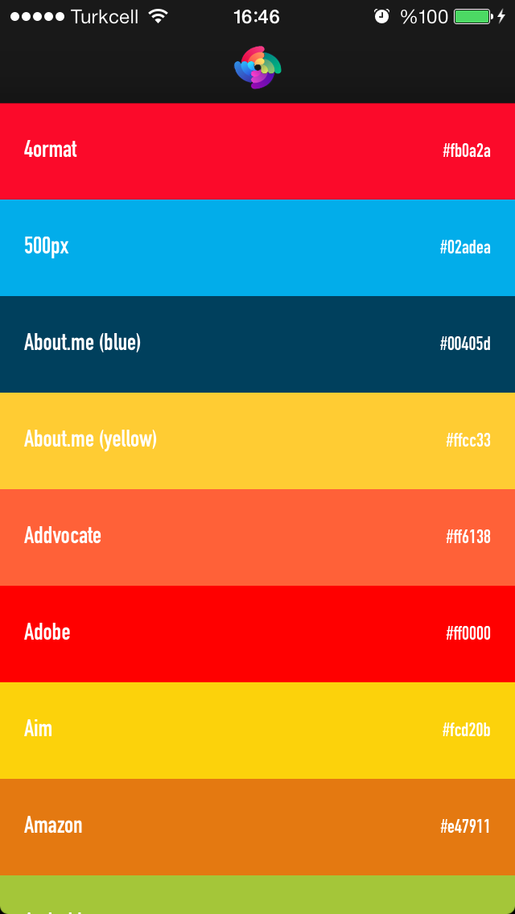

FPBrandColors
=============

A category for UIColor a collection of major brand color codes

About
----------
FPBrandColors is a simple category on UIColor which provides you some of the Brand colors used throughout.

## Preview

## Installation

Drag the included <code>UIColor+FPBrandColor.h</code> and <code>UIColor+FPBrandColor.m</code> files into your project. They are located in the top-level directory. You can see a demo of how to use these with the included Xcode project as well.

<code>#import "UIColor+FPBrandColor.h"</code> into the classes you want to use this category in and you're all set.

Cocoapods
-------

CocoaPods are the best way to manage library dependencies in Objective-C projects.
Learn more at http://cocoapods.org

Add this to your podfile to add the UIColor+FPBrandColor category to your project.

    pod 'FPBrandColors',  '~> 1.0.0'

Usage
----------

Usage is really simple. Just include `UIColor+FPBrandColor.h` & `UIColor+FPBrandColor.m` in your project if you're not using cocoapods and import the header file you need the colors.

    #import "UIColor+FPBrandColor.h"

Color List
----------

    + (UIColor *) Fourormat;
    + (UIColor *) FiveHundredPX;
    + (UIColor *) AboutMeBlue;
    + (UIColor *) AboutMeYellow;
    + (UIColor *) Addvocate;
    + (UIColor *) Adobe;
    + (UIColor *) Aim;
    + (UIColor *) Amazon;
    + (UIColor *) Android;
    + (UIColor *) Asana;
    + (UIColor *) Atlassian;
    + (UIColor *) Behance;
    + (UIColor *) bitly;
    + (UIColor *) Blogger;
    + (UIColor *) Carbonmade;
    + (UIColor *) Cheddar;
    + (UIColor *) CocaCola;
    + (UIColor *) CodeSchool;
    + (UIColor *) Delicious;
    + (UIColor *) Dell;
    + (UIColor *) Designmoo;
    + (UIColor *) Deviantart;
    + (UIColor *) DesignerNews;
    + (UIColor *) Dewalt;
    + (UIColor *) DisqusBlue;
    + (UIColor *) DisqusOrange;
    + (UIColor *) Dribbble;
    + (UIColor *) Dropbox;
    + (UIColor *) Drupal;
    + (UIColor *) Dunked;
    + (UIColor *) eBay;
    + (UIColor *) Ember;
    + (UIColor *) Engadget;
    + (UIColor *) Envato;
    + (UIColor *) Etsy;
    + (UIColor *) Evernote;
    + (UIColor *) Fab;
    + (UIColor *) Facebook;
    + (UIColor *) Firefox;
    + (UIColor *) FlickrBlue;
    + (UIColor *) FlickrPink;
    + (UIColor *) Forrst;
    + (UIColor *) Foursquare;
    + (UIColor *) Garmin;
    + (UIColor *) GetGlue;
    + (UIColor *) Gimmebar;
    + (UIColor *) GitHub;
    + (UIColor *) GoogleBlue;
    + (UIColor *) GoogleGreen;
    + (UIColor *) GoogleRed;
    + (UIColor *) GoogleYellow;
    + (UIColor *) GooglePlus;
    + (UIColor *) Grooveshark;
    + (UIColor *) Groupon;
    + (UIColor *) HackerNews;
    + (UIColor *) HelloWallet;
    + (UIColor *) HerokuLight;
    + (UIColor *) HerokuDark;
    + (UIColor *) HootSuite;
    + (UIColor *) Houzz;
    + (UIColor *) HP;
    + (UIColor *) HTML5;
    + (UIColor *) Hulu;
    + (UIColor *) IBM;
    + (UIColor *) IKEA;
    + (UIColor *) IMDb;
    + (UIColor *) Instagram;
    + (UIColor *) Instapaper;
    + (UIColor *) Intel;
    + (UIColor *) Intuit;
    + (UIColor *) Kickstarter;
    + (UIColor *) kippt;
    + (UIColor *) Kodery;
    + (UIColor *) LastFM;
    + (UIColor *) LinkedIn;
    + (UIColor *) Livestream;
    + (UIColor *) Lumo;
    + (UIColor *) MakitaRed;
    + (UIColor *) MakitaBlue;
    + (UIColor *) Mixpanel;
    + (UIColor *) Meetup;
    + (UIColor *) Netflix;
    + (UIColor *) Nokia;
    + (UIColor *) NVIDIA;
    + (UIColor *) Odnoklassniki;
    + (UIColor *) Opera;
    + (UIColor *) Path;
    + (UIColor *) PayPalDark;
    + (UIColor *) PayPalLight;
    + (UIColor *) Pinboard;
    + (UIColor *) Pinterest;
    + (UIColor *) PlayStation;
    + (UIColor *) Pocket;
    + (UIColor *) Prezi;
    + (UIColor *) Pusha;
    + (UIColor *) Quora;
    + (UIColor *) QuoteFm;
    + (UIColor *) Rdio;
    + (UIColor *) Readability;
    + (UIColor *) RedHat;
    + (UIColor *) RedditBlue;
    + (UIColor *) RedditOrange;
    + (UIColor *) Resource;
    + (UIColor *) Rockpack;
    + (UIColor *) Roon;
    + (UIColor *) RSS;
    + (UIColor *) Salesforce;
    + (UIColor *) Samsung;
    + (UIColor *) Shopify;
    + (UIColor *) Skype;
    + (UIColor *) SmashingMagazine;
    + (UIColor *) Snagajob;
    + (UIColor *) Softonic;
    + (UIColor *) SoundCloud;
    + (UIColor *) SpaceBox;
    + (UIColor *) Spotify;
    + (UIColor *) Sprint;
    + (UIColor *) Squarespace;
    + (UIColor *) StackOverflow;
    + (UIColor *) Staples;
    + (UIColor *) StatusChart;
    + (UIColor *) Stripe;
    + (UIColor *) StudyBlue;
    + (UIColor *) StumbleUpon;
    + (UIColor *) TMobile;
    + (UIColor *) Technorati;
    + (UIColor *) TheNextWeb;
    + (UIColor *) Treehouse;
    + (UIColor *) Trello;
    + (UIColor *) Trulia;
    + (UIColor *) Tumblr;
    + (UIColor *) TwitchTv;
    + (UIColor *) Twitter;
    + (UIColor *) Typekit;
    + (UIColor *) TYPO3;
    + (UIColor *) Ubuntu;
    + (UIColor *) Ustream;
    + (UIColor *) Venmo;
    + (UIColor *) Verizon;
    + (UIColor *) Vimeo;
    + (UIColor *) Vine;
    + (UIColor *) Virb;
    + (UIColor *) VirginMedia;
    + (UIColor *) VKontakte;
    + (UIColor *) Wooga;
    + (UIColor *) WordPressBlue;
    + (UIColor *) WordPressOrange;
    + (UIColor *) WordPressGrey;
    + (UIColor *) Wunderlist;
    + (UIColor *) XBOX;
    + (UIColor *) XING;
    + (UIColor *) Yahoo;
    + (UIColor *) Yandex;
    + (UIColor *) Yelp;
    + (UIColor *) YouTube;
    + (UIColor *) Zalongo;
    + (UIColor *) Zendesk;
    + (UIColor *) Zerply;
    + (UIColor *) Zootool;

Reap What I Sow!
-

This project is distributed under the standard MIT License. Please use this and twist it in whatever fashion you wish - and recommend any cool changes to help the code.

## Credits

[Faprica LTD](https://www.faprica.com)

## New Brand Color
If you wish to suggest a new brand, report a bug, or pitch a new feature idea for Brand Colors. Please create an issue and I'll get back to you as soon as possible.
